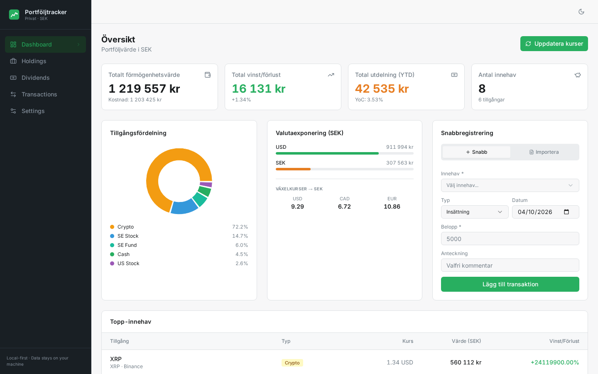

# Portföljtracker 📊

> A self-hosted, privacy-first financial dashboard to track your global net worth across banks, stocks, crypto, and mutual funds — with SEK as the base currency.



---

## Features

### Dashboard (Översikt)
- **4 KPI cards** — Total portfolio value, Total gain/loss (% and SEK), Total dividends received (with Yield on Cost), and number of holdings
- **Asset allocation donut chart** — Visual breakdown by asset type
- **Currency exposure & Live FX** — Real-time tracking of SEK, USD, CAD, EUR, BTC, BNB, XRP, ETH and more
- **Innehav per bank** — NEW: Automatically aggregates and displays total balances per bank/broker (Avanza, Nordnet, Swedbank, Binance, etc.)
- **Top holdings table** — Ranked positions with detailed Kurs and SEK value, integrated directly into the layout for better alignment
- **Snabbregistrering (Quick entry)** — Fast transaction logging and smart parser for CSV imports from Swedish banks

### Holdings (Innehav)
- **Tabbed Layout** — Organized by **Aktier**, **Fonder**, **ETF:er**, **Krypto**, and **Kassa** for easy navigation
- Per-row data: quantity, live price (in native currency), market value (SEK), cost basis (SEK), gain/loss %
- Bulk "Uppdatera kurser" support for all non-manual positions
- Search/filter bar across name, ticker, and account within each tab

### Dividends (Utdelningar)
- Log dividend events with per-share amount → auto-calculates total from current quantity
- **Yield on Cost (YoC)** table per holding — total dividends ÷ cost basis
- Full historical tracking with SEK conversion based on historical or current rates

### Settings (Inställningar)
- **Tabbed Asset Management** — Manage Stocks, Funds, ETFs, and Cryptos in separate categories
- **Smart Asset Search** — "Lägg till ny tillgång" now features a real-time Yahoo Finance search on all tabs, auto-populating Name, Ticker, Marketplace, and Currency
- **Live FX rate refresh** — fetches global rates and crypto prices (BTC, ETH, etc.) with one click
- **Manual FX rate override** — lock specific rates for stable calculations
- **Data transparency** — visual disclosure of all external API touchpoints

---

## Supported Asset Types

| Type | Label | Default Currency |
|------|-------|-----------------|
| `stock_se` | SE Stock | SEK |
| `stock_us` | US Stock | USD |
| `stock_ca` | CA Stock | CAD |
| `crypto` | Crypto | USD |
| `fund_se` | SE Fund | SEK |
| `fund_us` | US Fund | USD |
| `fund_de` | DE Fund | EUR |
| `cash` | Cash | SEK |

---

## Price Data Sources

| Asset Type | Source | Notes |
|------------|--------|-------|
| SE/US/CA Stocks | [Yahoo Finance](https://finance.yahoo.com) | Appends `.ST` for Stockholm, `.TO` for Toronto |
| SE/US/DE Funds | Yahoo Finance | `.ST` suffix for SE funds |
| Crypto | [CoinGecko](https://www.coingecko.com) | Supports BTC, ETH, SOL, ADA, DOT, AVAX, MATIC, BNB, XRP, DOGE, LTC, LINK and more |
| FX Rates | [open.er-api.com](https://open.er-api.com) | Free, no API key required |
| Niche SE Funds | Manual | Set `manualPrice: true` to skip auto-refresh |

---

## Tech Stack

| Layer | Technology |
|-------|-----------|
| Frontend | React 18 + TypeScript + Vite |
| UI Components | shadcn/ui + Radix UI |
| Styling | Tailwind CSS v3 |
| Data Fetching | TanStack Query v5 |
| Routing | Wouter (hash-based) |
| Charts | Recharts |
| Backend | Express.js |
| Database | SQLite via Drizzle ORM (`better-sqlite3`) |
| Validation | Zod + drizzle-zod |

All data is stored locally in `portfolio.db` (SQLite). Nothing is sent to external servers except price/FX API calls.

---

## Getting Started

## Prerequisites

### Node.js 22+ and Native Modules
This application uses `better-sqlite3`, which requires compilation of native C++ modules on installation.

**Windows Users:**
If you are using Node.js 22 or 25, you **must** have the **Visual Studio C++ Build Tools** installed. If `npm install` fails with C++ compilation errors:
1. Download [Visual Studio Community](https://visualstudio.microsoft.com/downloads/).
2. During installation, select the **"Desktop development with C++"** workload.
3. Ensure "MSVC v143 - VS 2022 C++ x64/x86 build tools" is checked.
4. Restart your terminal and run `npm install` again.

- Node.js 18+ (tested primarily on 22/23)
- npm

### Installation

```bash
git clone https://github.com/christerjohansson/portfolio-tracker.git
cd portfolio-tracker
npm install
```

### Development

```bash
npm run dev
```

Opens at [http://localhost:5000](http://localhost:5000). The Express backend and Vite frontend both serve from the same port.

### Production Build

```bash
npm run build
NODE_ENV=production node dist/index.cjs
```

---

## Project Structure

```
portfolio-tracker/
├── client/
│   └── src/
│       ├── components/
│       │   ├── ui/              # shadcn/ui components
│       │   └── AddQuickEntry.tsx
│       ├── lib/
│       │   ├── portfolio.ts     # Calculations: SEK conversion, gain/loss, YoC
│       │   └── queryClient.ts
│       ├── pages/
│       │   ├── Dashboard.tsx
│       │   ├── Holdings.tsx
│       │   ├── Dividends.tsx
│       │   ├── Transactions.tsx
│       │   └── Settings.tsx
│       └── index.css            # Avanza-inspired color palette
├── server/
│   ├── routes.ts                # All API endpoints
│   └── storage.ts               # Drizzle ORM + SQLite storage layer
├── shared/
│   └── schema.ts                # Drizzle schema: assets, holdings, transactions, dividends, fxRates
└── portfolio.db                 # SQLite database (auto-created, gitignored)
```

---

## API Endpoints

| Method | Endpoint | Description |
|--------|----------|-------------|
| GET | `/api/assets` | List all assets |
| POST | `/api/assets` | Create asset |
| PATCH | `/api/assets/:id` | Update asset |
| DELETE | `/api/assets/:id` | Delete asset |
| GET | `/api/holdings` | List all holdings |
| POST | `/api/holdings` | Create holding |
| PATCH | `/api/holdings/:id` | Update holding |
| DELETE | `/api/holdings/:id` | Delete holding |
| POST | `/api/holdings/:id/refresh-price` | Refresh price for one holding |
| POST | `/api/holdings/refresh-all` | Refresh all prices + FX rates |
| GET | `/api/transactions` | List all transactions |
| POST | `/api/transactions` | Create transaction |
| DELETE | `/api/transactions/:id` | Delete transaction |
| GET | `/api/dividends` | List all dividends |
| POST | `/api/dividends` | Log dividend event |
| DELETE | `/api/dividends/:id` | Delete dividend |
| GET | `/api/fx-rates` | Get current FX rates |
| PATCH | `/api/fx-rates/:currency` | Manually update a rate |
| POST | `/api/fx-rates/refresh` | Fetch live rates from API |
| POST | `/api/parse-transaction` | Smart parser for Avanza/Nordnet export rows |

---

## Color System

Inspired by [Avanza.se](https://www.avanza.se):

| Color | Hex | Used for |
|-------|-----|----------|
| Green | `#27AE60` | Gains, net worth totals, profit |
| Orange | `#E67E22` | Dividends, action buttons, withdrawals |
| White | `#FFFFFF` | Card backgrounds |
| Near-black | `#1A1A1A` | Sidebar, primary typography |

Full dark mode support with a toggle in the top-right corner.

---

## Privacy & Security

- **100% Local Storage**: All financial data, transactions, and settings live in `portfolio.db` (SQLite) on your own machine.
- **No Cloud, No Metadata Tracking**: Unlike commercial trackers, this app does not have a "backend" in the cloud. Your data never leaves your computer.
- **External Calls Only for Market Data**:
  - [Yahoo Finance API](https://finance.yahoo.com) (Stocks/Funds prices)
  - [CoinGecko API](https://www.coingecko.com) (Crypto prices)
  - [open.er-api.com](https://open.er-api.com) (Exchange rates)
- **Git Safety**: `portfolio.db` and `.env` are included in `.gitignore` by default to prevent accidental data leaks to GitHub.

---

## License

MIT
